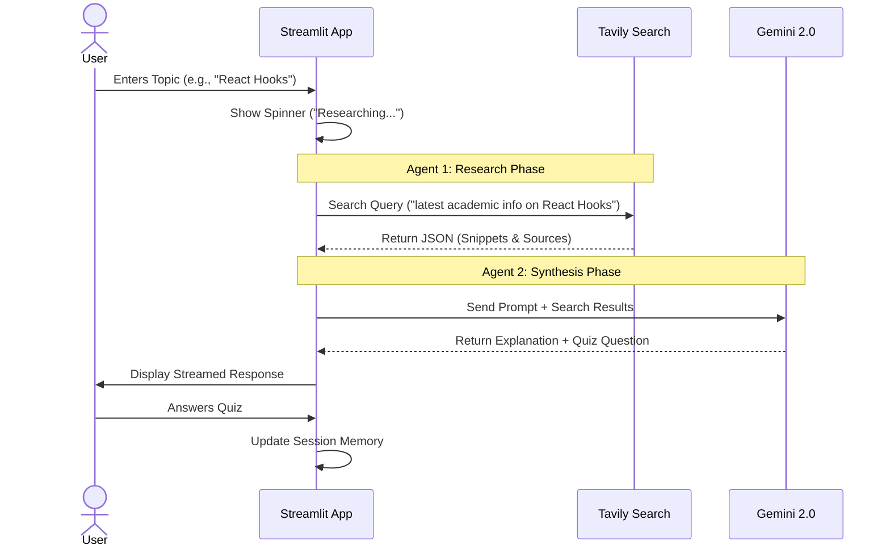

# 🎓 ExamPrep Concierge


> **A Multi-Agent AI Study Partner that autonomously researches topics and generates conceptual quizzes using Google Gemini 2.0 Flash.**

---

## 🚀 Live Demo
**[Try the App Here](https://examprep-agent.streamlit.app/)** *Hosted on Streamlit Community Cloud*

---

## 📖 Table of Contents
1. [The Story & Problem](#-the-story--problem)
2. [The Solution](#-the-solution)
3. [Technical Architecture](#-technical-architecture)
4. [Diagrams (Architecture, Flow, Sequence)](#-system-diagrams)
5. [Design & Thought Process](#-design--thought-process)
6. [Alternative Approaches](#-alternative-approaches-vs-final-decision)
7. [Testing Strategy](#-testing--validation)
8. [Folder Structure](#-folder-structure)
9. [Local Setup](#-local-setup)

---

## 🗣 The Story & Problem

**The "Student's Dilemma"**
As a Computer Science student, I found myself constantly switching contexts. I would have 20 tabs open: Wikipedia for definitions, GeeksforGeeks for examples, and ChatGPT for explanations.

**The Problem with Static LLMs:**
1.  **Hallucinations:** Asking a standard LLM about a brand new library often results in outdated or made-up code.
2.  **Passive Learning:** Reading an answer is easy; verifying you actually *understood* it requires active recall (quizzing), which most chat interfaces don't prioritize.

## 💡 The Solution

**ExamPrep Concierge** is an "Agentic" workflow, not just a chatbot. It mimics the behavior of a human tutor:
1.  **It Researches:** It doesn't guess. It goes to the web (via Tavily) to find the latest documentation.
2.  **It Synthesizes:** It reads the search results to form a grounded truth.
3.  **It Tests:** It generates a specific multiple-choice question based *only* on the research, forcing the user to engage.

---

## ⚙️ Technical Architecture

The system operates on a **Sequential Multi-Agent Architecture**.

### **Tech Stack**
* **Frontend/Server:** Python + Streamlit (Chosen for rapid prototyping and native data support).
* **Brain (LLM):** Google Gemini 2.0 Flash (Chosen for low latency and high reasoning capability).
* **Tools:** Tavily AI Search API (Optimized for LLM-readable search results).
* **Memory:** `st.session_state` (In-memory context management).
* **Environment:** Python Dotenv (Security management).

---

## 📊 System Diagrams

### 1. High-Level Architecture
How the components connect in the cloud.

```mermaid
graph TD
    User[End User] <-->|HTTPS| Cloud[Streamlit Community Cloud]
    subgraph "Application Logic (Python)"
        Orchestrator[Agent Orchestrator]
        Memory[(Session State)]
    end
    
    Cloud <--> Orchestrator
    Orchestrator <-->|Read/Write| Memory
    
    subgraph "External APIs"
        Tavily[Tavily Search API]
        Gemini[Google Gemini 2.0 Flash]
    end
    
    Orchestrator -->|Step 1: Research| Tavily
    Orchestrator -->|Step 2: Reason| Gemini
````

### 2\. Information Flowchart

The logic path the agent takes for every query.

```mermaid
flowchart LR
    A[User Input] --> B{Input Valid?}
    B -- No --> C[Show Warning]
    B -- Yes --> D[Agent 1: Researcher]
    D --> E[Call Tavily Search Tool]
    E --> F[Retrieve Context Snippets]
    F --> G[Agent 2: Tutor]
    G --> H[Call Gemini 2.0 Flash]
    H --> I[Generate Explanation + Quiz]
    I --> J[Update Chat UI]
```

### 3\. Sequence Diagram (The Request Lifecycle)

A detailed look at the asynchronous handoffs.



-----

## 🎨 Design & Thought Process

### **Design Language**

Even though Streamlit is a "low-code" UI, I adhered to specific design principles:

  * **Minimalism:** No sidebar clutter. Focus entirely on the chat interface.
  * **Feedback Loops:** Used `st.spinner` states clearly so the user knows *exactly* when the agent is "Thinking" vs. "Searching".
  * **Dark Mode Native:** The color palette relies on Streamlit's system default to ensure accessibility across devices.

### **The "Why" Behind The Code**

1.  **Integration of Tavily vs. Standard Search:**
      * Standard search (Google/DDG) returns HTML soup full of ads.
      * I chose **Tavily** because it returns *clean text chunks* specifically formatted for LLMs, reducing token usage and improving Gemini's accuracy.
2.  **Sequential Agents vs. Autonomous Agents:**
      * I intentionally hard-coded the sequence (Research -\> Tutor) rather than letting the LLM decide.
      * *Reasoning:* For a study tool, consistency is key. We *always* want research first. Autonomous loops can sometimes skip steps or get stuck; sequential chains are robust.

-----

## 🔄 Alternative Approaches vs. Final Decision

During development, I hit several roadblocks. Here is how I pivoted:

| Component | Alternative Considered | Why I Rejected It | Final Choice |
| :--- | :--- | :--- | :--- |
| **Search Tool** | `duckduckgo-search` | It worked locally but was blocked (403 Forbidden) immediately upon Cloud Deployment due to rate limits. | **Tavily API** (Enterprise reliability). |
| **Frontend** | React + Node.js | Too much boilerplate for a 4-day hackathon. I needed to focus on the *Agent Logic*, not CSS components. | **Streamlit** (Python-native, instant deploy). |
| **Model** | `gemini-1.5-pro` | Slower latency and higher token cost. | **Gemini 2.0 Flash** (Instant, free, multimodal). |
| **Deployment** | Google Cloud Run | Requires billing verification (credit card) which creates friction for student projects. | **Streamlit Cloud** (Free, GitHub-integrated). |

-----

## 🧪 Testing & Validation

Before the public release, this project underwent three layers of testing:

1.  **Local Unit Testing:**
      * Verified that the API keys load correctly from `.env`.
      * Tested handling of empty search results (fallback messages).
2.  **Cloud Simulation:**
      * Ran the app in a fresh `venv` to simulate the cloud environment (caught the `ModuleNotFoundError` for Tavily this way).
3.  **Stress Testing:**
      * Tested rapidly changing topics to ensure `st.session_state` clears correctly.
      * Tested obscure topics to verify the Search Tool actually finds data.

-----

## 📂 Folder Structure

```text
examprep-agent/
├── .streamlit/          # Cloud configuration (created on deploy)
├── venv/                # Local virtual environment (ignored by git)
├── .env                 # API Keys (ignored by git)
├── .gitignore           # Security rules
├── app.py               # Main Application Logic (The "Brain")
├── Dockerfile           # Containerization instructions
├── requirements.txt     # Dependency list
└── README.md            # Documentation
```

-----

## 💻 Local Setup

If you want to run this agent on your own machine:

1.  **Clone the repo:**

    ```bash
    git clone [https://github.com/mdnm18/examprep-agent.git](https://github.com/mdnm18/examprep-agent.git)
    cd examprep-agent
    ```

2.  **Install Dependencies:**

    ```bash
    pip install -r requirements.txt
    ```

3.  **Set up API Keys:**
    Create a `.env` file and add:

    ```bash
    GEMINI_API_KEY="your_google_key"
    TAVILY_API_KEY="your_tavily_key"
    ```

4.  **Run the App:**

    ```bash
    streamlit run app.py
    ```

-----

*Built with ❤️ by MD NAYAJ MONDAL for the Kaggle Agents Intensive 2025.*
